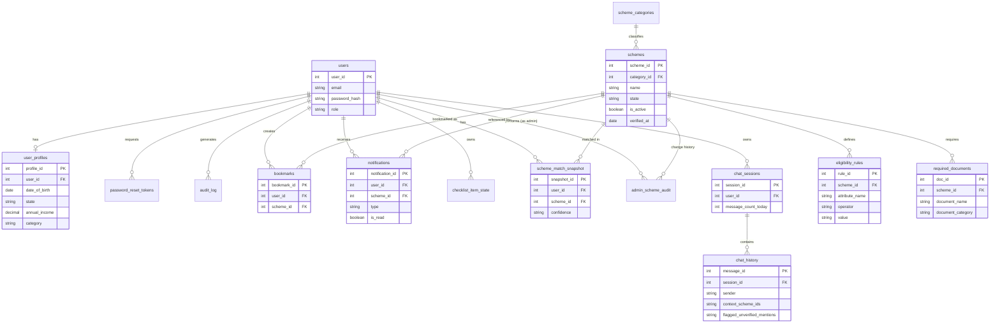
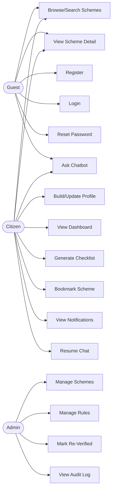
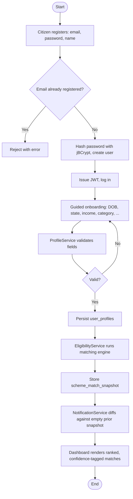
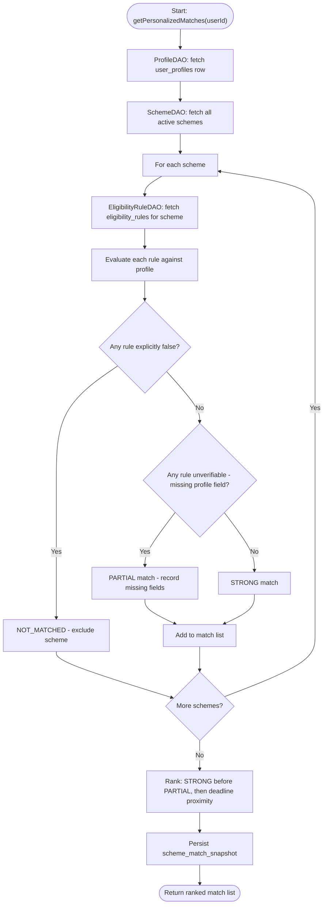
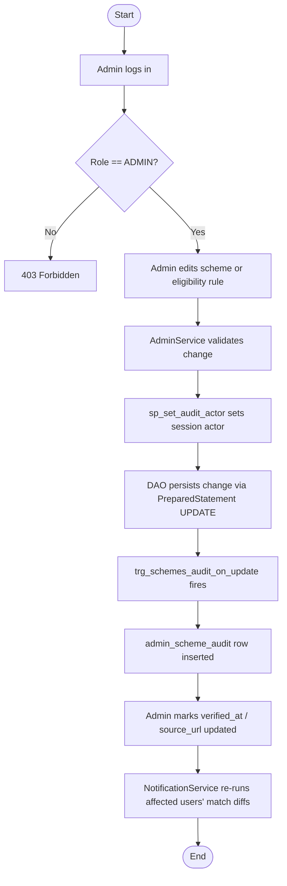
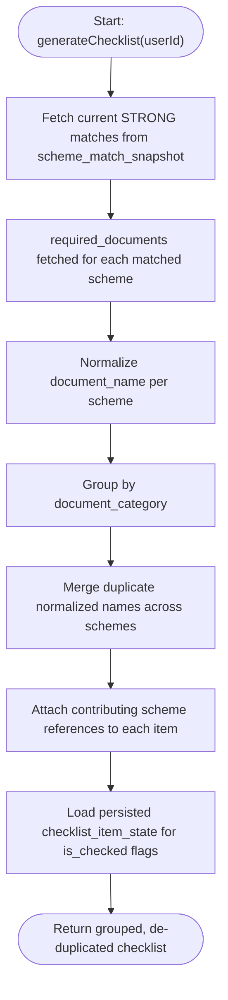
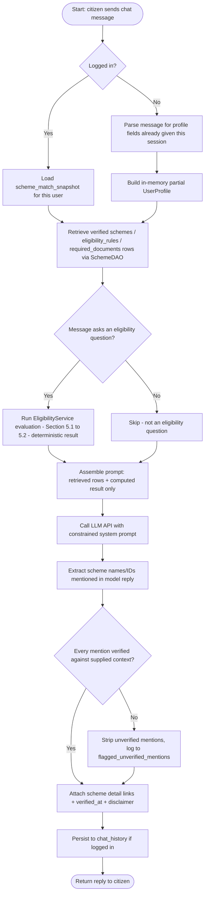

# SAARTHI
## Software Requirements Specification
**Document Version:** 1.0
**Technology Stack:** Java · JSP · Servlet · JDBC · MySQL (via XAMPP) · React
**Architecture:** MVC2 (Strict) — Servlets (Controller) · Service (Business Logic) · DAO (Data Access, plain JDBC)

---

## 1. Introduction

### 1.1 Purpose
This Software Requirements Specification (SRS) defines the functional, non-functional, and data requirements for **Saarthi** — a personalized government scheme discovery platform for Indian citizens. It is intended for use by the development team (Khushi Singh, Mohit Gupta), the project guide/reviewer, and any future contributor as the authoritative reference for design, implementation, and testing.

### 1.2 Scope
Saarthi enables any Indian citizen to create a personal profile once and receive a continuously updated, personalized list of every Central and Maharashtra State government welfare scheme they are eligible for — with plain-language eligibility explanations, required-document checklists, and direct links to official application portals. The platform additionally provides an independent Scheme Explorer for profile-agnostic browsing/search, a Bookmarks feature, a Notifications feature for newly-unlocked matches, an AI Chatbot for conversational, verification-gated scheme discovery, and an Admin module for maintaining scheme and eligibility-rule data over time.

The system distinguishes three principal categories of actor:
*   **Guest (unauthenticated visitor)** — browses the public Scheme Explorer and may use the Chatbot for general, non-personalized discovery.
*   **Citizen (registered user)** — creates a profile, views personalized matches, browses/searches all schemes, bookmarks schemes, generates document checklists, receives notifications, and converses with the Chatbot using their own profile as context.
*   **Admin (internal user)** — maintains the scheme catalog, eligibility rules, and required-document data that the matching engine — and, by extension, the Chatbot's grounding data — depends on.

The AI Chatbot (Module 8, Section 3.8) is specified in full in this SRS as a first-class module, including the grounding/accuracy mechanism (Section 5.6) that keeps its answers traceable to verified data rather than model-invented content; its implementation is sequenced after the core platform modules (Section 9).

### 1.3 Definitions, Acronyms and Abbreviations
| Term | Meaning |
| :--- | :--- |
| **SRS** | Software Requirements Specification |
| **MVC2** | Model-View-Controller 2 (Servlet-as-Controller design pattern) |
| **DAO** | Data Access Object — class owning all SQL for one entity |
| **POJO** | Plain Old Java Object — data-carrier bean |
| **JWT** | JSON Web Token — used for stateless API authentication |
| **BPL** | Below Poverty Line |
| **EWS** | Economically Weaker Section |
| **OBC / SC / ST** | Other Backward Class / Scheduled Caste / Scheduled Tribe — social category classifications used in Indian scheme eligibility |
| **KYC** | Know Your Customer (not used for financial KYC here — reused loosely to mean identity/profile completeness in this SRS's context where relevant) |
| **Match Confidence** | This project's classification of a scheme match as Strong (all rules directly verified against profile data) or Partial (profile missing data needed to verify one or more rules) |
| **RBAC** | Role-Based Access Control |

### 1.4 References
*   IEEE 830-1998 — Recommended Practice for Software Requirements Specifications (structural reference)
*   MySQL 8.x Reference Manual (applies to the XAMPP-bundled MySQL/MariaDB server used for development)
*   Java Servlet 3.1 / JSP 2.3 Specification (`javax.servlet.*` namespace, matching Tomcat 8.5.99)

---

## 2. Overall Description

### 2.1 Product Perspective
Saarthi is a standalone, self-contained multi-tier web application following the strict MVC2 pattern:

```
Browser (React SPA, Axios) --REST/JSON--> Servlets (Controller, @WebServlet)
    --> Service classes (business logic, incl. Eligibility Matching Engine)
    --> DAO classes (plain JDBC, PreparedStatement)
    --> MySQL / MariaDB (via XAMPP)
```

A small number of server-rendered JSP pages (JSTL + EL only, no scriptlets) are used only where React is not required — e.g. the admin login error page.

### 2.2 User Classes and Characteristics
| Actor | Description | Access Level |
| :--- | :--- | :--- |
| **Guest (unauthenticated visitor)** | Can view the landing page and browse the public Scheme Explorer; cannot see personalized matches or bookmark schemes | Public, read-only |
| **Citizen (registered user)** | Creates/updates a profile, views personalized matches, scheme details, checklist, bookmarks, notifications | Self-scoped |
| **Admin** | Manages scheme catalog, eligibility rules, required documents; views system-wide data | Full system access |

### 2.3 Operating Environment
*   **Application Server:** Apache Tomcat 8.5.99 (standalone, registered as an Eclipse server runtime)
*   **Database Server:** MySQL / MariaDB, bundled with XAMPP
*   **IDE:** Eclipse IDE for Enterprise Java and Web Developers (WTP)
*   **Build:** No Maven — dependencies (`mysql-connector-j`, `gson`, `jbcrypt`, `jjwt` + its Jackson dependencies) are manually placed in `WEB-INF/lib`
*   **Client:** Any modern browser (Chrome, Edge, Firefox) — responsive React SPA, mobile-first

### 2.4 Design and Implementation Constraints
*   Strict MVC2 separation, enforced with **no exceptions**:
    *   Controllers (Servlets) contain **no SQL** and **no POJO construction** — only request parsing, calling Service methods, and writing the JSON response (via Gson).
    *   Service classes contain **all business logic**, including the entire Eligibility Matching Engine, and construct/populate POJOs.
    *   DAO classes contain **all SQL**, written as `PreparedStatement` queries, and are the only classes that open a JDBC `Connection`.
    *   JSP views (where used) use **JSTL + EL only** — `<% %>` scriptlets are forbidden.
*   No ORM (Hibernate) is used — DAOs manually map `ResultSet` rows to POJOs.
*   All monetary/benefit-amount values that are numeric (not free-text like "up to ₹50,000 or as per slab") are stored as `DECIMAL`, never `FLOAT`/`DOUBLE`.
*   Passwords are stored as `jBCrypt`-hashed values; plain-text storage is never permitted.
*   All date fields use `DATE`/`DATETIME`/`TIMESTAMP` types consistently, since eligibility age-rule evaluation and deadline/notification logic depend on correct date arithmetic.
*   Scheme and eligibility-rule data is **not fetched live from any external API at request time**, since no stable public API for scheme eligibility data exists; the running application reads only from MySQL, seeded and subsequently maintained through the Admin module.

### 2.5 Assumptions and Dependencies
*   The eligibility matching engine evaluates only the structured attributes captured in a citizen's profile (age, gender, state, income, occupation, category, education, disability status, BPL/minority status) against structured `eligibility_rules` rows — it does not perform free-text or NLP-based eligibility inference (that is the deferred Chatbot module's domain).
*   Scheme, eligibility-rule, and document data is sourced and verified against official government sources through a dedicated offline data-sourcing process, and kept current via the Admin module, not through any live government API integration.
*   The current release covers Central Government schemes plus Maharashtra State schemes; other states are out of scope until a future data-refresh cycle.

---

## 3. Functional Requirements

### 3.1 Module 1 — Authentication and Authorization
*   **FR1.1** The system shall provide a registration workflow for Citizen accounts, capturing email, password, and full name.
*   **FR1.2** Passwords shall be hashed with jBCrypt before storage; plain-text passwords shall never be persisted or logged.
*   **FR1.3** The system shall implement Role-Based Access Control with two roles: `USER` and `ADMIN`.
*   **FR1.4** Login shall use email and password; on success the server issues a signed JWT (via `jjwt`) containing the user's ID and role, returned to the client for use as a Bearer token on subsequent requests.
*   **FR1.5** JWTs shall carry a configurable expiry (default 24 hours); expired or invalid tokens shall be rejected by a central `AuthFilter` before reaching any protected Controller.
*   **FR1.6** Password reset shall use a time-limited, single-use token delivered out-of-band (email, or displayed for demo purposes if email sending is not configured in the development environment).
*   **FR1.7** Every Controller handling a protected endpoint shall verify the caller's JWT (via `AuthFilter`) and, for admin-only endpoints, the caller's `ADMIN` role, before any Service method executes (contract precondition).
*   **FR1.8** Repeated failed login attempts (5 attempts / 15 minutes) shall trigger a temporary account lockout to mitigate brute-force attacks, tracked via a `failed_login_count` and `locked_until` field on `users`.
*   **FR1.9** The system shall log login, logout, and permission-denied events to an audit trail (`audit_log`).

### 3.2 Module 2 — User Profile & Onboarding
*   **FR2.1** On first login, the system shall present a guided, multi-step onboarding flow collecting: date of birth, gender, state, district, annual family income, occupation, social category (General/OBC/SC/ST/EWS), education level, disability status, BPL status, and minority status.
*   **FR2.2** All profile fields except date of birth, state, and category are optional at initial onboarding, but the dashboard shall visibly indicate which additional fields — if filled — would unlock more precise matching (per FR3.9).
*   **FR2.3** The system shall allow the citizen to update their profile at any time from a dedicated Profile page.
*   **FR2.4** Every profile create/update shall trigger the system to re-run the Eligibility Matching Engine (Module 3) so the dashboard reflects the change on next load — see Section 5.1.
*   **FR2.5** Profile validation shall reject clearly invalid values (age computed from date of birth outside 0–120, negative income) at the Service layer before persistence (contract precondition).

### 3.3 Module 3 — Personalized Scheme Dashboard (Eligibility Matching) — Core Module
*   **FR3.1** On dashboard load, the system shall return every active scheme the citizen's profile satisfies, using the Eligibility Rule Evaluation Algorithm (Section 5.1).
*   **FR3.2** The dashboard shall display a prominent total-match count and group matched schemes by category (Education, Healthcare, Housing, Financial Aid, Agriculture, Employment, etc.).
*   **FR3.3** Each scheme card shall display scheme name, issuing authority, a benefit summary, and a Match Confidence indicator (Strong / Partial — Section 5.2).
*   **FR3.4** The system shall provide a "refresh matches" action that re-runs the matching engine on demand (in addition to the automatic re-run on profile update per FR2.4).
*   **FR3.5** Matched schemes shall be ranked using the Scheme Relevance Ranking Algorithm (Section 5.3) before being returned to the client.
*   **FR3.6** The system shall never silently exclude a scheme solely because a required profile attribute is unset — such schemes shall appear as Partial matches (Section 5.2), not be hidden (contract invariant — no false negatives from incomplete profiles).
*   **FR3.7** The Controller for this module shall contain no matching logic; all evaluation happens in `EligibilityService`, and all rule/profile data retrieval happens in `ProfileDAO`, `SchemeDAO`, and `EligibilityRuleDAO`.
*   **FR3.8** The system shall support filtering the dashboard's matched schemes by category, client-side, without a further server round-trip once the initial match set is loaded.
*   **FR3.9** For each Partial match, the response shall indicate which specific profile field(s), if completed, would allow the match to be re-evaluated as Strong.

### 3.4 Module 4 — Scheme Explorer & Search
*   **FR4.1** The system shall provide a full, paginated catalog of all active schemes, independent of the viewer's profile, accessible to both Guests and Citizens.
*   **FR4.2** The Explorer shall support keyword search (scheme name/description) and filtering by state, category, and ministry.
*   **FR4.3** Explorer results shall be sortable by name and, where applicable, by application deadline.
*   **FR4.4** All filtering/search parameters shall be applied server-side using parameterized queries (`PreparedStatement` with dynamic but safely-bound `WHERE` clauses) — never string-concatenated SQL.

### 3.5 Module 5 — Scheme Detail & Information
*   **FR5.1** Each scheme's detail page shall display: full description, plain-language eligibility explanation (derived from the citizen's own profile against that scheme's rules, when logged in — e.g. *"You qualify because you are under 25, a student, and from Maharashtra"*), complete benefits, the full required-documents list, step-by-step application guidance, and a direct link to the official application/portal URL.
*   **FR5.2** For a Guest (not logged in), the detail page shall show the scheme's eligibility criteria as plain rule statements (not a personalized "why you qualify" explanation, since there is no profile to evaluate against).
*   **FR5.3** The detail page shall list 2–4 related/similar schemes (same category and/or overlapping eligibility attributes).
*   **FR5.4** Every scheme record served to the client shall include its `source_url` and `verified_at` date, so data provenance and freshness are inspectable.

### 3.6 Module 6 — Document Checklist Generator
*   **FR6.1** The system shall generate, on request, a single consolidated checklist of every document required across all of a citizen's currently matched (Strong-confidence) schemes.
*   **FR6.2** The checklist shall be de-duplicated and grouped by document category (ID Proof, Income Proof, Address Proof, Educational Certificate, etc.) using the Document Checklist De-duplication Algorithm (Section 5.4).
*   **FR6.3** Each checklist item shall be togglable (checked/unchecked) by the citizen, and this toggle state shall persist across sessions.
*   **FR6.4** Each checklist item shall retain a reference back to which matched scheme(s) require it, so a citizen can see why a document is on their list.

### 3.7 Module 7 — Bookmarks & Saved Schemes
*   **FR7.1** A logged-in citizen shall be able to bookmark or un-bookmark any scheme from the dashboard, Explorer, or Detail page.
*   **FR7.2** The system shall prevent a duplicate bookmark of the same scheme by the same user (contract invariant — enforced by a `UNIQUE(user_id, scheme_id)` constraint).
*   **FR7.3** The Bookmarks page shall list all bookmarked schemes with the same card format used on the dashboard, including current Match Confidence if the user is still eligible.

### 3.8 Module 8 — AI Chatbot Assistant (Supporting Feature)
A floating, conversational assistant for natural-language scheme discovery and Q&A. It is fully specified here as a first-class module; implementation is sequenced after Modules 1–7 and 9–10 since it is, by design, a secondary feature layered on top of the platform's core data — **the platform's value exists entirely without it**. Its defining design constraint is stated up front because it answers the project's hardest open question about this module — *how is it kept accurate rather than making things up?*

> **Grounding principle:** the chatbot is never "trained" on scheme data, and it never independently decides eligibility. It is a **retrieval-augmented, verification-gated** wrapper around the same deterministic, human-verified data and the same `EligibilityService` (Section 5.1–5.2) that the Dashboard uses. The LLM's job is limited to (a) turning a citizen's free-text question into structured lookups, and (b) turning verified structured results back into readable prose — never to recall or infer scheme facts from its own general training data.

*   **FR8.1** The system shall provide a floating chat widget, accessible from any page via a bottom-right icon, that expands into an overlay chat window without navigating away from the current page.
*   **FR8.2** For a logged-in citizen, `ChatService` shall retrieve that citizen's current `scheme_match_snapshot` (Section 5.1–5.2, already computed and stored — not re-derived by the LLM) and pass only the matched/candidate schemes' verified `schemes`, `eligibility_rules`, and `required_documents` rows into the model's context for that turn.
*   **FR8.3** For a Guest (not logged in) or a question naming an unrelated scheme, `ChatService` shall first run a targeted `SchemeDAO` keyword/category lookup against the verified catalog to build a small, relevant candidate set, and inject only those rows into context — the model is never given free rein over the full catalog or, worse, no data at all.
*   **FR8.4** The system prompt shall explicitly instruct the model to answer **only** from the structured data supplied in that turn's context, and to respond with an explicit "I don't have verified information on that" instead of guessing when the supplied context does not contain an answer (a hard constraint, not a suggestion the model may deviate from).
*   **FR8.5** For eligibility questions specifically (e.g. *"Am I eligible for PM Kisan?"*), the yes/no/partial determination itself shall always come from `EligibilityService`'s existing Section 5.1–5.2 evaluation — run against the citizen's real profile, or against fields the model has extracted from the conversation for a Guest — with the LLM only responsible for phrasing that already-computed result in plain language, never for deciding it itself.
*   **FR8.6** For a Guest who asks a discovery-style question (*"What can I get?"*), the model may ask natural-language follow-up questions to elicit age/state/income/category/etc., `ChatService` shall parse each reply into the same structured `UserProfile` fields Module 2 uses, and evaluation shall run through the identical `EligibilityService` code path used for logged-in citizens — no parallel/duplicate eligibility logic is implemented for the chatbot.
*   **FR8.7** **Post-response verification (hallucination guard):** before any chatbot reply is returned to the client, `ChatService` shall extract every scheme name/ID the model's response mentions and confirm each one via `SchemeDAO` actually exists and was present in that turn's supplied context; any mentioned scheme that fails this check shall be stripped from the response and logged, never shown to the citizen as fact.
*   **FR8.8** Every chatbot response that references a scheme shall include that scheme's name as a clickable link to its Scheme Detail page (Module 5) and, where available, its `verified_at` date — so a citizen can always independently confirm the chatbot's claim against the same source-of-truth data the rest of the platform is built on.
*   **FR8.9** Every chatbot response shall carry a standing disclaimer that eligibility shown is provisional and the citizen should confirm final eligibility on the scheme's official application portal before applying.
*   **FR8.10** Chat sessions and messages for logged-in citizens shall be persisted (`chat_sessions`, `chat_history`) so a citizen can resume a prior conversation; anonymous Guest conversations are session-scoped only and not persisted server-side.
*   **FR8.11** The system shall enforce a configurable per-user daily message-count limit to bound external LLM API cost, returning a clear "limit reached" response rather than silently failing once exceeded.
*   **FR8.12** `ChatController` shall contain no prompt-construction, retrieval, or verification logic — all of it lives in `ChatService`, consistent with the platform's strict MVC2 rule; the Controller only accepts the citizen's message, calls `ChatService.handleMessage(...)`, and returns the JSON response.

### 3.9 Module 9 — Admin / Data Management
*   **FR9.1** An Admin shall be able to create, update, and deactivate (soft-delete via `is_active = false`) scheme records.
*   **FR9.2** An Admin shall be able to add, edit, and remove `eligibility_rules` and `required_documents` rows for any scheme.
*   **FR9.3** Every create/update to a scheme or its eligibility rules shall be recorded in `admin_scheme_audit` with old value, new value, changed-by, and timestamp (mirrors the auditability pattern used for pricing changes in comparable logistics/e-commerce systems).
*   **FR9.4** The Admin module shall let an Admin update a scheme's `verified_at` date and `source_url` after manually re-checking it against the live source, as part of a periodic data refresh cycle.
*   **FR9.5** Admin-only Controllers shall reject any request whose JWT role is not `ADMIN` (contract precondition, enforced by `AuthFilter`).

### 3.10 Module 10 — Notifications
*   **FR10.1** The system shall generate a notification for a citizen when a profile update or a scheme-data change (via Admin) results in a new Strong-confidence match that did not exist in the citizen's previous match snapshot, using the Notification Trigger Algorithm (Section 5.5).
*   **FR10.2** The system shall generate a notification when a bookmarked or matched scheme's `deadline` is within 15 days.
*   **FR10.3** Notifications shall be markable as read individually or in bulk; unread count shall be shown as a badge.

---

## 4. Non-Functional Requirements
| Category | Requirement |
| :--- | :--- |
| **Performance** | Dashboard match computation shall return within 2 seconds for a catalog of up to 200 active schemes, using indexed lookups on `eligibility_rules.scheme_id` and `schemes.is_active`. |
| **Security** | RBAC enforced server-side via `AuthFilter` on every protected action; all SQL executed via `PreparedStatement` (no string-concatenated queries); JWT signature verified on every request; jBCrypt password hashing; CORS restricted to the known frontend origin in production. |
| **Availability** | Target availability suitable for a demo/academic-project deployment; no formal SLA. |
| **Scalability** | The DAO layer uses `DriverManager`-based JDBC connections per request in this release (no connection pool, since no Maven/HikariCP); documented as a known upgrade path if concurrent load ever requires pooling. |
| **Usability** | React SPA with mobile-first responsive layout, dark-mode-first design, and a guided onboarding flow so profile creation does not feel like a government form. |
| **Maintainability** | Strict MVC2 separation; one DAO per entity; all business/eligibility logic resides in the Service layer; no SQL in JSP, React, or Controller code. |
| **Auditability** | All create/update/delete operations on scheme, eligibility-rule, and account-security-relevant entities are recorded in `audit_log` or `admin_scheme_audit`. |
| **Data Integrity** | Foreign-key constraints enforced at the database level; uniqueness constraints (`UNIQUE(user_id, scheme_id)` for bookmarks, `UNIQUE(email)` for users) prevent duplicate/inconsistent data; Design-by-Contract-style preconditions/invariants (Sections 3 and 5) enforced at the Service layer as the primary line of defense, with DB constraints as the second. |
| **Data Accuracy** | Every seeded scheme record carries `source_url` and `verified_at`, so eligibility data is traceable to a verified government source rather than assumed correct indefinitely. |

---

## 5. Core Algorithms
These algorithms are this project's equivalent of an analytics suite — instead of sales/inventory analytics, they govern how a citizen's profile becomes a trustworthy, ranked, de-duplicated set of scheme recommendations, and how the Chatbot module (Section 3.8) stays grounded in that same trustworthy data. All of them run entirely inside `EligibilityService`/`ChecklistService`/`NotificationService`/`ChatService` (Model layer) — never in the Controller, and never as DB-side business logic (see Section 11's scope boundary).

### 5.1 Eligibility Rule Evaluation Algorithm
*   **Input:** one `UserProfile` row, and all `eligibility_rules` rows for one `Scheme`.
*   For a given scheme, all of its rule rows are **AND-ed** by default — every rule must be satisfied for the scheme to be considered a match candidate.
*   Range attributes (age, income) are represented as two separate rows (e.g. `age >= 18` and `age <= 35`); both must pass.
*   Group/OR conditions (e.g. "SC or ST or OBC") are represented as a single rule row with `operator = 'IN'` and a comma-separated `value` (e.g. `SC,ST,OBC`); the profile's category must appear in that set.
*   If the profile attribute referenced by a rule is unset (`NULL`), that specific rule is marked **unverifiable** rather than failed — it does not exclude the scheme outright; it feeds into Section 5.2 instead.
*   **Output:** per scheme, one of `NOT_MATCHED` (at least one rule explicitly fails), `PARTIAL` (zero rules explicitly fail, but ≥1 is unverifiable), or `STRONG` (all rules explicitly pass).

### 5.2 Match Confidence Scoring Algorithm
*   **Input:** the per-rule evaluation result set from Section 5.1 for one scheme.
*   `STRONG` = every rule directly evaluated `true` against known profile data.
*   `PARTIAL` = no rule directly evaluated `false`, but one or more rules could not be evaluated due to missing profile data; the algorithm also returns the specific missing field names (feeds FR3.9).
*   `NOT_MATCHED` schemes are excluded from the dashboard entirely (they are not "confidence zero" matches — they are confirmed non-matches).
*   **Output:** `{ schemeId, confidence: STRONG|PARTIAL, missingFields: [...] }` per scheme, consumed by Module 3's dashboard rendering.

### 5.3 Scheme Relevance Ranking Algorithm
*   **Input:** the list of `STRONG`/`PARTIAL` matches from Section 5.2.
*   Primary sort: `STRONG` before `PARTIAL`.
*   Secondary sort, within each confidence tier: schemes with an upcoming `deadline` (soonest first) before schemes with no deadline; then by category, to keep the "grouped by category" dashboard view stable and predictable.
*   **Output:** ordered `List<SchemeMatch>` returned to `MatchController`.

### 5.4 Document Checklist De-duplication Algorithm
*   **Input:** `required_documents` rows for every `STRONG`-confidence matched scheme (Section 5.2).
*   Documents are grouped by a normalized `document_category` (ID Proof, Income Proof, Address Proof, Educational Certificate, Bank Details, Photograph, Other), and within a category, documents whose `document_name` matches after case-insensitive normalization (e.g. "Aadhaar Card" and "Aadhar card copy" both normalize to a single canonical "Aadhaar Card" entry) are merged into one checklist item.
*   Each merged checklist item retains a list of every scheme that requires it (feeds FR6.4).
*   **Output:** `List<ChecklistItem>` grouped by category, each with its contributing scheme references.

### 5.5 Notification Trigger Algorithm
*   **Input:** a citizen's previous match snapshot (last computed `STRONG` match set, stored per user) and the newly computed match set (Section 5.3), run whenever the profile changes (FR2.4) or an Admin updates scheme/rule data (FR9.1–9.2).
*   Computes the set difference: schemes present in the new `STRONG` set but absent from the previous snapshot are "newly unlocked."
*   For each newly-unlocked scheme, one notification row is created (FR10.1); the snapshot is then updated to the new set so the same scheme does not re-notify on the next run.
*   Deadline-proximity notifications (FR10.2) are evaluated separately, independent of profile changes, by comparing `schemes.deadline` against the current date for all matched/bookmarked schemes.

### 5.6 Chat Context Assembly & Grounding Algorithm (Module 8)
This is the algorithm that answers *"how does the chatbot stay accurate?"* — the model is never fine-tuned or otherwise "trained" on scheme data; accuracy comes from constraining what it is allowed to say on every single turn.
*   **Input:** the citizen's current message, their `scheme_match_snapshot` if logged in (Section 5.1–5.2 output, already computed and verified), or a partial in-conversation profile if a Guest.
*   **Step 1 — Retrieve, don't recall:** `ChatService` runs a `SchemeDAO`/`EligibilityRuleDAO` lookup (reusing existing DAOs — no new SQL surface) to assemble a small, relevant set of verified scheme rows: the citizen's existing matches if the question is about "my schemes," or a keyword/category search result if the question names or implies a specific scheme.
*   **Step 2 — Deterministic eligibility, not model inference:** if the message asks an eligibility question, the actual match/no-match/partial answer is computed by re-invoking `EligibilityService` (Section 5.1–5.2) — the same code path the Dashboard uses — not asked of the LLM.
*   **Step 3 — Constrained generation:** only the retrieved rows (Step 1) and the computed result (Step 2) are serialized into the prompt context; the system prompt forbids answering from anything outside that context and mandates the "I don't have verified information on that" fallback (FR8.4) when the context is insufficient.
*   **Step 4 — Post-generation verification:** every scheme name/ID the model's reply mentions is checked against the context actually supplied that turn (FR8.7); anything not traceable back to a real, verified `schemes` row is stripped before the reply reaches the citizen.
*   **Output:** a reply that is either fully traceable to verified `schemes`/`eligibility_rules`/`required_documents` data and a deterministic Java computation, or an explicit "I don't know" — by construction, never a free invention of scheme facts.

---

## 6. Database Design — Complete Table and Attribute List

### 6.1 User and Access Tables

**Table: users**
| Attribute | Notes |
| :--- | :--- |
| `user_id (PK)` | Unique user identifier |
| `email (unique)` | Login email |
| `password_hash` | jBCrypt salted hash |
| `full_name` | Display name |
| `role` | ENUM('USER','ADMIN') |
| `status` | Active / Locked |
| `failed_login_count` | Used for lockout enforcement |
| `locked_until` | Nullable timestamp; set on lockout |
| `last_login_at` | Timestamp of last successful login |
| `created_at / updated_at` | Audit timestamps |

**Table: user_profiles**
| Attribute | Notes |
| :--- | :--- |
| `profile_id (PK)` | Unique profile identifier |
| `user_id (FK -> users, unique)` | One profile per user |
| `date_of_birth` | Used to derive age for rule evaluation |
| `gender` | ENUM('MALE','FEMALE','OTHER') |
| `state / district` | Location |
| `annual_income` | DECIMAL(12,2) |
| `occupation` | Free-text/enum (Student, Farmer, Self-Employed, Salaried, Unemployed, etc.) |
| `category` | ENUM('GENERAL','OBC','SC','ST','EWS') |
| `education_level` | Highest completed education |
| `disability_status` | BOOLEAN |
| `is_bpl` | BOOLEAN |
| `is_minority` | BOOLEAN |
| `last_match_snapshot_at` | Timestamp of the last completed matching run (supports Section 5.5) |
| `updated_at` | Triggers re-matching (FR2.4) |

**Table: password_reset_tokens**
| Attribute | Notes |
| :--- | :--- |
| `token_id (PK)` | Unique token identifier |
| `user_id (FK -> users)` | Owning user |
| `token_value (unique)` | Single-use reset token |
| `expires_at` | Validity window |
| `used_at` | Nullable — set once consumed |

**Table: audit_log**
| Attribute | Notes |
| :--- | :--- |
| `log_id (PK)` | Unique log entry identifier |
| `user_id (FK -> users, nullable)` | Actor, where applicable |
| `action` | LOGIN / LOGOUT / LOGIN_FAILED / PERMISSION_DENIED / PASSWORD_RESET |
| `ip_address` | Client IP address |
| `timestamp` | When the action occurred |

### 6.2 Scheme and Eligibility Tables

**Table: scheme_categories**
| Attribute | Notes |
| :--- | :--- |
| `category_id (PK)` | Unique category identifier |
| `category_name (unique)` | Education, Healthcare, Housing, Financial Aid, Agriculture, Employment, etc. |
| `icon_name` | UI icon reference |
| `display_order` | Dashboard/Explorer ordering |

**Table: schemes**
| Attribute | Notes |
| :--- | :--- |
| `scheme_id (PK)` | Unique scheme identifier |
| `name` | Scheme name |
| `description` | Full description |
| `ministry` | Issuing ministry/department |
| `category_id (FK -> scheme_categories)` | Category |
| `state` | Nullable — NULL means Central/nationwide |
| `benefit_summary` | Short summary shown on cards |
| `benefit_amount` | Free-text (amounts vary/are slab-based per scheme) |
| `application_url` | Direct application link |
| `official_portal` | Official reference/info page |
| `is_active` | Soft-delete flag |
| `deadline` | Nullable application deadline |
| `source_url` | Ground-truth government/official page used for verification |
| `verified_at` | Date the eligibility data was last checked against `source_url` |
| `created_at / updated_at` | Audit timestamps |

**Table: eligibility_rules**
| Attribute | Notes |
| :--- | :--- |
| `rule_id (PK)` | Unique rule identifier |
| `scheme_id (FK -> schemes)` | Related scheme |
| `attribute_name` | age / annual_income / gender / category / state / occupation / education_level / disability_status / is_bpl / is_minority |
| `operator` | `=`, `!=`, `>=`, `<=`, `>`, `<`, `IN` |
| `value` | Comparison value; comma-separated for `IN` |
| `rule_description` | Plain-language phrasing of this rule, used in FR5.1's "why you qualify" text |
| `source_text_snippet` | Exact phrase from the verified source this rule was derived from, kept for traceability |

**Table: required_documents**
| Attribute | Notes |
| :--- | :--- |
| `doc_id (PK)` | Unique document requirement identifier |
| `scheme_id (FK -> schemes)` | Related scheme |
| `document_name` | e.g. "Aadhaar Card" |
| `document_category` | ID Proof / Income Proof / Address Proof / Educational Certificate / Bank Details / Photograph / Other |
| `is_mandatory` | BOOLEAN |

**Table: admin_scheme_audit**
| Attribute | Notes |
| :--- | :--- |
| `audit_id (PK)` | Unique audit entry identifier |
| `scheme_id (FK -> schemes)` | Related scheme |
| `changed_field` | Field name that changed |
| `old_value / new_value` | Change values (text) |
| `changed_by (FK -> users)` | Admin who made the change |
| `changed_at` | Timestamp |

### 6.3 Matching, Checklist, and Engagement Tables

**Table: scheme_match_snapshot**
| Attribute | Notes |
| :--- | :--- |
| `snapshot_id (PK)` | Unique snapshot entry identifier |
| `user_id (FK -> users)` | Related user |
| `scheme_id (FK -> schemes)` | Matched scheme |
| `confidence` | STRONG / PARTIAL (Section 5.2) |
| `computed_at` | When this match was last computed — supports Section 5.5's diffing |

**Table: checklist_item_state**
| Attribute | Notes |
| :--- | :--- |
| `state_id (PK)` | Unique identifier |
| `user_id (FK -> users)` | Owning user |
| `document_name (normalized)` | Matches the de-duplicated checklist item (Section 5.4) |
| `is_checked` | BOOLEAN — persisted toggle state (FR6.3) |
| `updated_at` | Timestamp |

**Table: bookmarks**
| Attribute | Notes |
| :--- | :--- |
| `bookmark_id (PK)` | Unique bookmark identifier |
| `user_id (FK -> users)` | Owning user |
| `scheme_id (FK -> schemes)` | Bookmarked scheme |
| `created_at` | Timestamp |
| *(constraint)* | `UNIQUE(user_id, scheme_id)` — FR7.2 |

**Table: notifications**
| Attribute | Notes |
| :--- | :--- |
| `notification_id (PK)` | Unique notification identifier |
| `user_id (FK -> users)` | Recipient |
| `scheme_id (FK -> schemes, nullable)` | Related scheme, where applicable |
| `type` | NEW_MATCH / DEADLINE_APPROACHING |
| `title / message` | Display text |
| `is_read` | BOOLEAN |
| `created_at` | Timestamp |

### 6.4 Chatbot Tables (Module 8)

**Table: chat_sessions**
| Attribute | Notes |
| :--- | :--- |
| `session_id (PK)` | Unique chat session identifier |
| `user_id (FK -> users, nullable)` | Owning citizen; NULL for an anonymous Guest session (not persisted past the browser session per FR8.10) |
| `started_at / last_message_at` | Session activity timestamps |
| `message_count_today` | Running count used to enforce the daily limit (FR8.11) |

**Table: chat_history**
| Attribute | Notes |
| :--- | :--- |
| `message_id (PK)` | Unique message identifier |
| `session_id (FK -> chat_sessions)` | Parent session |
| `sender` | ENUM('USER','BOT') |
| `message` | Message text |
| `context_scheme_ids` | Comma-separated `scheme_id`s actually supplied to the model this turn (Section 5.6 Step 1) — kept for auditability of what the bot was and wasn't allowed to say |
| `flagged_unverified_mentions` | Any scheme name the model mentioned but that failed the Section 5.6 Step 4 verification check, logged rather than silently dropped, so grounding failures are inspectable |
| `created_at` | Timestamp |

---

## 7. Entity Relationship Summary
The key foreign-key relationships across the schema are as follows:
*   `user_profiles.user_id -> users.user_id`
*   `password_reset_tokens.user_id -> users.user_id`
*   `audit_log.user_id -> users.user_id`
*   `schemes.category_id -> scheme_categories.category_id`
*   `eligibility_rules.scheme_id -> schemes.scheme_id`
*   `required_documents.scheme_id -> schemes.scheme_id`
*   `admin_scheme_audit.scheme_id -> schemes.scheme_id`
*   `admin_scheme_audit.changed_by -> users.user_id`
*   `scheme_match_snapshot.user_id -> users.user_id`
*   `scheme_match_snapshot.scheme_id -> schemes.scheme_id`
*   `checklist_item_state.user_id -> users.user_id`
*   `bookmarks.user_id -> users.user_id`
*   `bookmarks.scheme_id -> schemes.scheme_id`
*   `notifications.user_id -> users.user_id`
*   `notifications.scheme_id -> schemes.scheme_id`
*   `chat_sessions.user_id -> users.user_id (nullable, for Guest sessions)`
*   `chat_history.session_id -> chat_sessions.session_id`

---

## 8. Use Case Summary

| Use Case | Primary Actor | Preconditions | Postconditions |
| :--- | :--- | :--- | :--- |
| **Register** | Guest | Valid email not already registered | User created, `status = Active`, password hashed |
| **Login** | Registered User | Valid credentials; account not locked | JWT issued; `last_login_at` updated |
| **Build/Update Profile** | Citizen | Logged in | `user_profiles` upserted; matching engine re-run (FR2.4) |
| **View Personalized Dashboard** | Citizen | Profile exists (may be partial) | Ranked, confidence-tagged match list rendered |
| **Browse/Search Schemes** | Guest / Citizen | None | Paginated, filtered scheme list rendered |
| **View Scheme Detail** | Guest / Citizen | Scheme is active | Detail rendered; personalized explanation if logged in |
| **Generate Document Checklist** | Citizen | ≥1 Strong match exists | De-duplicated, categorized checklist rendered |
| **Toggle Checklist Item** | Citizen | Checklist generated at least once | `checklist_item_state` updated |
| **Bookmark / Un-bookmark Scheme** | Citizen | Scheme exists; not already bookmarked (for bookmark) | `bookmarks` row created/removed |
| **View Notifications** | Citizen | Logged in | Notification list + unread count rendered |
| **Mark Notification Read** | Citizen | Notification exists and belongs to user | `is_read = true` |
| **Add/Edit Scheme** | Admin | Logged in as Admin | `schemes` row created/updated; `admin_scheme_audit` entry created |
| **Add/Edit Eligibility Rule** | Admin | Scheme exists | `eligibility_rules` row created/updated |
| **Deactivate Scheme** | Admin | Scheme exists | `is_active = false`; excluded from future matching runs |
| **Mark Scheme Re-Verified** | Admin | Scheme exists | `verified_at`, `source_url` updated |
| **Ask Chatbot a Question** | Guest / Citizen | Chat widget opened | `ChatService` assembles grounded context (Section 5.6), returns a verified, source-linked reply |
| **Resume Chat Session** | Citizen | Logged in; prior `chat_sessions` row exists | Prior `chat_history` loaded into the widget |

---

## 9. Future Enhancements
The following items are recognized as valuable extensions but are out of scope for the current release:
*   Multi-language (Hindi and regional language) UI support.
*   Application status tracker integrated with government portals.
*   Document upload & vault (DigiLocker integration).
*   Voice input for accessibility.
*   Native mobile application (React Native).
*   Live/automated scheme data synchronization, should a stable official API become available.
*   Expansion of state-level scheme coverage beyond Maharashtra.

---

## 10. Implementation Standards (Eclipse + JSP/Servlet)

The middle-tier and frontend are implemented using Java EE technologies (`javax.servlet` namespace, Tomcat 8.5.99) within the Eclipse IDE, with no Maven and no Hibernate. All development must adhere to the following standards to ensure consistency, maintainability, and strict MVC2 compliance.

### 10.1 Project Structure (Eclipse Dynamic Web Project)
*   `src/` (maps to `WEB-INF/classes`) — Contains all Java packages:
    *   `com.saarthi.model` — POJOs representing database entities (`User`, `UserProfile`, `Scheme`, `EligibilityRule`, `RequiredDocument`, `SchemeMatch`, `ChecklistItem`, `Bookmark`, `Notification`, etc.).
    *   `com.saarthi.dao` — Data Access Objects, one per entity, all SQL via `PreparedStatement`.
    *   `com.saarthi.service` — Business logic, including the Eligibility Matching Engine (Section 5) and contract validation.
    *   `com.saarthi.controller` — Servlets (`@WebServlet`-annotated) handling HTTP requests.
    *   `com.saarthi.filter` — `AuthFilter` (JWT/RBAC enforcement), CORS filter (development only).
    *   `com.saarthi.util` — `DBUtil` (JDBC connection helper), `PasswordUtil` (jBCrypt wrapper), `JwtUtil`, `JsonUtil` (Gson wrapper).
*   `WebContent/`
    *   `WEB-INF/web.xml` — filter mappings, error pages.
    *   `WEB-INF/lib/` — manually-downloaded JARs: `mysql-connector-j-9.7.0.jar`, `gson-2.x.x.jar`, `jbcrypt-0.4.jar`, `jjwt-0.9.1.jar`, `jackson-databind`/`jackson-core`/`jackson-annotations`.
    *   `WEB-INF/classes/db.properties` — DB URL/user/password (gitignored; `.example` committed).
    *   `jsp/` — JSP view files, where used (organized by module).

### 10.2 Architectural Pattern: MVC2
*   **Controller (Servlets):** Entry point for all requests. Extracts parameters/JWT, invokes the appropriate Service method, serializes the returned POJO/list to JSON (Gson), and writes the response. Never touches SQL or constructs domain POJOs itself.
*   **Model (POJOs, Services, DAOs):** Services own all business logic — including every algorithm in Section 5 — and construct/populate POJOs. DAOs execute SQL via `PreparedStatement` (SQL-injection safe) and map `ResultSet` rows to POJOs manually.
*   **View (React SPA; JSP where used):** React components render UI and call REST endpoints via Axios — no business logic. Any JSP page uses **JSTL + EL only**; `<% %>` scriptlets are forbidden.

### 10.3 Coding and Formatting Guidelines
*   **Naming Conventions:** Classes `PascalCase` (`SchemeController`, `EligibilityService`); methods/variables `camelCase`; constants `UPPER_SNAKE_CASE`; JSP files `kebab-case.jsp`.
*   **Security & RBAC:** `AuthFilter` intercepts all `/api/*` requests to protected endpoints, validates the JWT signature/expiry, and checks the decoded role against the endpoint's required permission (`USER` vs `ADMIN`) before the Servlet's `doGet`/`doPost` executes.
*   **Resource Management:** All JDBC resources (`Connection`, `PreparedStatement`, `ResultSet`) are opened and closed within the same DAO method using try-with-resources.
*   **UI/UX:** React with a custom design system (no Bootstrap), dark-mode-first, mobile-first.

---

## 11. Database-Level Automation: Functions, Triggers & Stored Procedures

**Scope boundary (important):** per Section 2.4's strict MVC2 constraint, **no eligibility-matching business logic lives in the database.** Everything in Section 5 executes in Java (`EligibilityService`, `ChecklistService`, `NotificationService`). The functions/triggers/procedures below are limited to **data integrity, derived/computed values, and audit-trail automation only** — the kind of work a database is legitimately responsible for regardless of application architecture.

### 11.1 Triggers

**`trg_users_before_update`** (BEFORE UPDATE ON `users`)
Sets `updated_at = CURRENT_TIMESTAMP` automatically on every row update, so the Service layer never has to remember to set it manually.

**`trg_user_profiles_before_update`** (BEFORE UPDATE ON `user_profiles`)
Sets `updated_at = CURRENT_TIMESTAMP`. This timestamp change is what `ProfileService` checks to decide whether a re-match run (FR2.4) is due.

**`trg_schemes_audit_on_update`** (AFTER UPDATE ON `schemes`)
For each of the tracked fields (`name`, `benefit_summary`, `is_active`, `deadline`, `verified_at`), if the old and new value differ, inserts a row into `admin_scheme_audit` capturing `changed_field`, `old_value`, `new_value`. (`changed_by` is set by the Service layer via a session variable set at the start of the transaction, since the DB layer has no knowledge of the authenticated user — see 11.3.)

**`trg_bookmarks_prevent_orphan`** (BEFORE INSERT ON `bookmarks`)
Defensive check that `scheme_id` refers to an active scheme (`is_active = true`); raises an error (`SIGNAL SQLSTATE`) if not, as a second line of defense behind the Service-layer check (FR7.1 preconditions).

### 11.2 Functions

**`fn_calculate_age(dob DATE) RETURNS INT`**
Computes age in completed years from a date of birth as of `CURRENT_DATE`. Used only for read-time convenience queries (e.g. an Admin report listing profiles by age band) — **never** by the matching engine itself, which computes age in Java from the same `date_of_birth` value for consistency with the rest of Section 5's logic (avoiding two independent age-calculation implementations that could drift).

**`fn_days_until_deadline(deadline DATE) RETURNS INT`**
Returns the number of days between `CURRENT_DATE` and a scheme's `deadline` (negative if past). Used by `NotificationService`'s deadline-proximity check (FR10.2) as a query-time convenience, with the ≤15-day threshold decision still made in Java.

### 11.3 Stored Procedures

**`sp_set_audit_actor(IN actor_user_id INT)`**
Sets a session variable (`SET @audit_actor_id = actor_user_id`) at the start of an Admin request's DB transaction, called from `AdminService` immediately after opening the connection, so `trg_schemes_audit_on_update` can populate `admin_scheme_audit.changed_by` without the trigger needing direct access to the application's JWT context.

**`sp_prune_expired_reset_tokens()`**
Deletes `password_reset_tokens` rows where `expires_at < CURRENT_TIMESTAMP`. Invoked periodically (e.g. via a scheduled Admin action, or manually during maintenance) — not on a DB-native event scheduler, to keep all "when does this run" decisions visible in application code rather than hidden in DB configuration.

**`sp_get_dashboard_summary_counts(IN p_user_id INT)`**
A read-only convenience procedure returning `{strong_match_count, partial_match_count, bookmark_count, unread_notification_count}` in one round trip, used by `MatchController` to avoid four separate DAO calls for the dashboard's summary header. Pure aggregation of data already computed and stored by Section 5's algorithms — not a re-implementation of any matching logic.

---

## 12. ER Diagram



---

## 13. Use Case Diagram



---

## 14. Activity Diagrams

### 14.1 Registration → Onboarding → First Dashboard View



### 14.2 Eligibility Matching Engine (Section 5.1–5.3 combined)



### 14.3 Admin Scheme / Rule Management



### 14.4 Document Checklist Generation



### 14.5 Chatbot Message Handling — Grounding & Verification (Section 5.6)



---

*Document Version: 1.0*
*Architecture: Strict MVC2 · Eclipse · Tomcat 8.5.99 · Plain JDBC · No Maven, No Hibernate*
*AI Chatbot Module: fully specified in Sections 3.8, 5.6, 6.4, 7, 8, 12, 13 and 14.5; implementation sequenced after the core platform modules*
